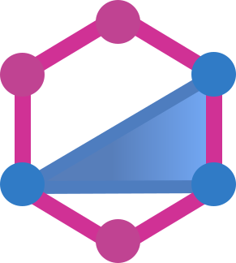

<h1 align=center>Playground full-stack project:  videogame ranking website and API.</h1>

:construction::construction::construction::construction: Work in Progress :construction::construction::construction::construction:

<h3 align="center">
  <a href="https://gap.nicodeamador.com/">Visit the live app</a> |
  <a href="https://github.com/ndeamador/game-affinity-project-server">View server repository</a>
</h3>

 

<!-- Some icons from: https://github.com/marwin1991/profile-technology-icons#-javascript  -->
<!-- Handy generator: https://marwin1991.github.io/profile-technology-icons/ -->

  

    
    
    
    
  

  

    
    
    
    
  

  

    
    
    
    
    
  

  

    
    
    
    
  

 

---

## Features

- Written in modern React with hooks using only functional components.
- Local state management with React and Apollo Graphql.
- Project fully written in TypeScript.
- Full user authentication system.
- Persistent drag-and-drop ranking system.
- [Custom server](https://github.com/ndeamador/game-affinity-project-server) interfacing a PostgreSQL database for accounts and ratings persistence, a Redis sessions cache, and connections to a [third party API](https://api-docs.igdb.com/).
- Deployment pipeline using GitHub Actions with automated testing, linting and Docker image building and publishing.
- Optimized Docker images (e.g.: reduced backend image size from 1.23 GB to 189 MB with a multi-stage build).
- Project deployed to production using Vercel and a self-managed Digital Ocean Ubuntu droplet running Docker virtual machines.

 

## Pending

- Mobile friendly design: due to the structure of the drag-and-drop system, a custom, mobile-specific, responsive rating module for "My Library" needs to be built from scratch.
- Better production automation for PostgreSQL migrations.
- Lexorank implementation for efficient Drag and Drop persistence.
- Updated tests for most recent features.
